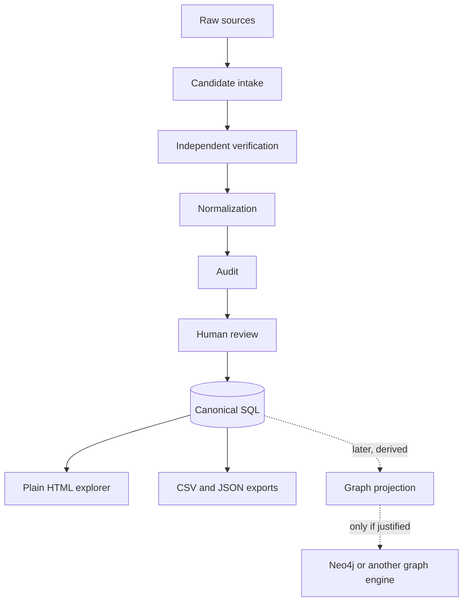

# Architecture

## What

Structura keeps canonical knowledge in a relational database while modelling entities and relationships in a graph-compatible form.

## Why

Early questions are catalogue questions that SQL handles directly: products by year, category, manufacturer, or market. Entity/predicate/object records keep the same data ready for graph traversal without maintaining two competing sources of truth.

## How

### Canonical layer

SQLite is the current local store. PostgreSQL is a plausible later migration when concurrency, recursive traversal, indexing, or contribution workflows require it.

### Data shape

- `entities` stores stable identities and review state.
- `product_details` stores census-friendly date and model fields.
- `relationships` stores subject/predicate/object assertions.
- `sources` stores provenance metadata and source tier.
- evidence tables connect sources to entity fields and relationships, including contradictory or contextual evidence.
- `review_events` preserves promotion rationale.

### Derived layers

HTML, CSV, JSON-LD, RDF, visual graphs, or Neo4j must be regenerated from SQL. None becomes an independently edited canonical database.

## Assumptions

- One local writer is adequate initially.
- Entity keys remain stable even if display names change.
- Dates are ISO-like text plus explicit precision rather than fabricated exact values.
- The ontology will change after real records challenge it.

## Validation steps

- Apply migrations to a clean database.
- Run SQLite foreign-key checks.
- Reject canonical entities and relationships without supporting evidence.
- Confirm HTML requests perform read-only connections.
- Test representative catalogue queries before introducing graph infrastructure.
